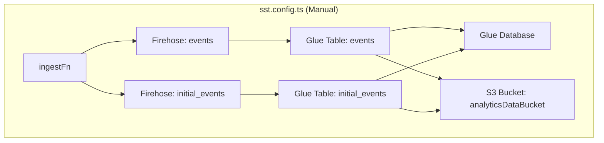
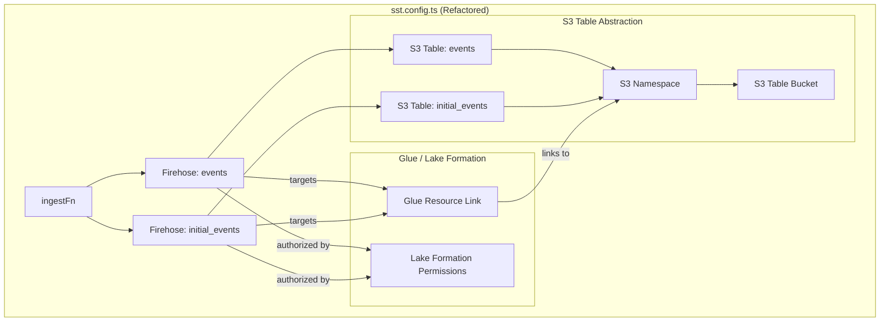

### Plan: Migrate to S3 Tables

The core of this plan is to replace the manually defined `sst.aws.Bucket`, `aws.glue.CatalogDatabase`, and `aws.glue.CatalogTable` resources with the integrated `aws.s3tables.*` resources. This will also involve updating the Kinesis Firehose streams and the associated IAM permissions.

---

#### Architectural Overview

Here is a diagram illustrating the shift in architecture.

**Before (Current Manual Setup):**

**After (S3 Tables Integrated Setup):**

---

#### Step-by-Step Migration Plan

1.  **Remove Obsolete Resources:**
    *   Delete the `analyticsDataBucket` (`sst.aws.Bucket`).
    *   Delete the `glueCatalogDatabase` (`aws.glue.CatalogDatabase`).
    *   Delete the `glueTables` resources and the logic that creates them.
    *   Remove the `sst.Linkable.wrap` definitions for `aws.glue.CatalogDatabase` and `aws.glue.CatalogTable`.
    *   Delete the old `firehoseDeliveryRole` and its associated `aws.iam.RolePolicy`.
    *   Delete the `glueIcebergOptimizerRole` and its policies. The S3 Tables service, combined with Iceberg's capabilities, should manage table optimization. We can re-evaluate if manual compaction is needed later.

2.  **Define S3 Table Foundation (for both `events` and `initial_events`):**
    *   Create a single `aws.s3tables.TableBucket`. We'll give it a new logical name like `AnalyticsS3TableBucket` to ensure replacement.
    *   Create a single `aws.s3tables.Namespace` within that bucket.
    *   Create two `aws.s3tables.Table` resources: one for `events` and one for `initial_events`, both pointing to the same namespace and bucket.
    *   Create a new `sst.aws.Bucket` to serve as the backup location for Firehose.

3.  **Establish New IAM Role and Permissions:**
    *   Create a new `aws.iam.Role` for Firehose, named something like `FirehoseS3TablesRole`.
    *   Create a corresponding `aws.iam.Policy` that grants permissions for:
        *   **Glue:** To interact with the default catalog and the resource link.
        *   **Lake Formation:** `lakeformation:GetDataAccess`.
        *   **S3:** Full access to the Firehose backup bucket.
        *   **CloudWatch Logs:** For logging Firehose stream activity.

4.  **Bridge Catalogs with Resource Link & Lake Formation:**
    *   Using `command.local.Command`, create a **Glue Database Resource Link**. This is the key that allows Firehose (and other services) to see the S3 Table namespace within the standard AWS Glue Catalog.
    *   Using `command.local.Command`, grant the necessary **Lake Formation permissions** to the new Firehose IAM role, allowing it to `DESCRIBE` the database (namespace) and `SELECT`, `INSERT`, `ALTER`, `DESCRIBE` both of the tables.

5.  **Reconfigure Kinesis Firehose Streams:**
    *   Create two new `aws.kinesis.FirehoseDeliveryStream` resources, one for each table.
    *   Change the `destination` from `extended_s3` to `iceberg`.
    *   In the `icebergConfiguration`:
        *   Reference the new `FirehoseS3TablesRole`.
        *   Point to the default Glue catalog ARN.
        *   Set the `destinationTableConfigurations` to use the **Glue Resource Link name** as the `databaseName` and the S3 Table name (`events` or `initial_events`) as the `tableName`.
        *   Configure the `s3Configuration` to point to the new backup bucket.

6.  **Update Dependent Resources and Outputs:**
    *   Update the `ingestFn` to link to the two new Firehose streams.
    *   Update the `queryFn`'s links: remove the links to the old Glue tables and database, and instead link the new `AnalyticsS3TableBucket`. The function will still query through Athena, which will resolve the tables via the resource link.
    *   Clean up the stack outputs, removing references to the old Glue resources and adding new ones for the S3 Table bucket ARN and table names.