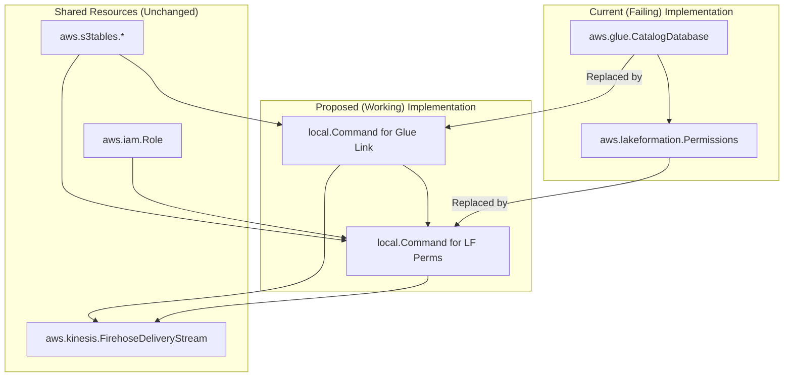

# S3 Tables Pulumi/SST Implementation Plan

## 1. Analysis of the Problem

The core issue is that the native Pulumi AWS provider resources, specifically `aws.glue.CatalogDatabase` (for creating the resource link) and `aws.lakeformation.Permissions`, do not correctly handle the special `s3tablescatalog`.

- **Lake Formation Error**: The error `"database.0.catalog_id" doesn't look like AWS Account ID (exactly 12 digits): "s3tablescatalog"` confirms that the `aws.lakeformation.Permissions` resource expects the `catalogId` to be a standard 12-digit AWS Account ID, but for S3 Tables, we need to reference the special `s3tablescatalog`.
- **Glue Error**: The `EntityNotFoundException: Catalog not found` error when creating the `s3TableNamespaceLink` strongly suggests the `aws.glue.CatalogDatabase` resource also fails to resolve `s3tablescatalog` as a valid target catalog.

The provided documentation shows that these operations are possible via the AWS CLI, which is often updated more quickly to support new service features.

## 2. The Plan

The plan is to modify `sst.config.s3tables.ts` to use `local.Command` for the steps that are failing. This will work around the current limitations of the Pulumi AWS provider.

### Detailed Steps:

1.  **Remove Failing Pulumi Resources**: Delete the `aws.glue.CatalogDatabase` resource named `s3TableNamespaceLink` and the three `aws.lakeformation.Permissions` resources (`LfPermDescribeLink`, `LfPermDb`, and `LfPermTable`).

2.  **Create Glue Resource Link via CLI**: Replace the `aws.glue.CatalogDatabase` resource with a `new local.Command`. This command will execute `aws glue create-database` to create the resource link that points to the S3 Table namespace. It will have a corresponding `delete` command for cleanup.

3.  **Grant Lake Formation Permissions via CLI**: Replace the three `aws.lakeformation.Permissions` resources with three separate `local.Command` resources. These will use the `aws lakeformation grant-permissions` and `revoke-permissions` commands to manage access for the Firehose role, correctly targeting resources within the `s3tablescatalog`.

4.  **Update Resource Dependencies**: Update the `dependsOn` array of the `firehoseDeliveryStream` to reference the new `local.Command` resources, ensuring everything is created in the correct order.

5.  **Manual Steps**: The one-time manual setup to enable S3 Tables integration in your AWS Region remains a prerequisite. This plan automates all the subsequent steps.

This approach should resolve the deployment errors by using the AWS CLI's more robust support for S3 Tables, while keeping the rest of your infrastructure defined cleanly in Pulumi.